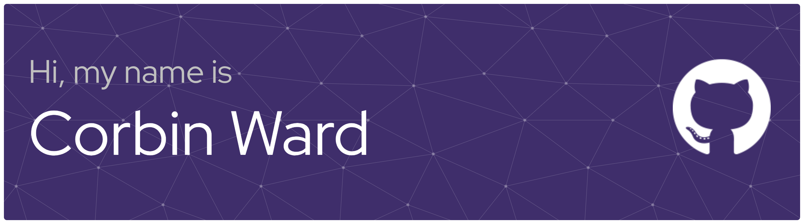

<h3 align="center">A Product-Minded Engineer who bridges the gap between user-centric design and scalable code.</h3>

  
  
  

<h2 align="center">My Toolkit</h2>

  I'm experienced in the full product lifecycle, from initial user research and design in Figma to building, deploying, and scaling full-stack applications.

<table width="100%">
  <tr>
    <td align="center" width="33%">
      
        
      
      
      
      
    </td>
    <td align="center" width="33%">
      
        
      
      
      
      
    </td>
    <td align="center" width="33%">
      
        
      
      
      
      
    </td>
  </tr>
</table>

<h2 align="center">My GitHub Activity</h2>

  
  

<h2 align="center">Featured Projects</h2>

<table width="100%">
  <tr>
    <td width="50%" valign="top">
      <h3>LLM Assisted Scheduler</h3>
      

        An AI-powered tool to automate course planning using natural language. I defined the <strong>product vision</strong>, conducted user testing, and designed the interactive <strong>Figma prototypes</strong> to simplify a complex UI.
      

      

        
        
        
      

    </td>
    <td width="50%" valign="top">
      <h3>Team Lead - Customer Process Portal</h3>
      

        As <strong>Product Owner</strong>, I led a team of 4 developers to build a customer-facing portal. I managed the full <strong>Agile lifecycle</strong>, prioritized the backlog based on client feedback, and translated user research into a seamless UI.
      

      

        
        
        
      

    </td>
  </tr>
  
  <tr>
    <td width="50%" valign="top">
      <h3>Accessibility (HandsFree Scholar)</h3>
      

        A comprehensive accessibility system for hands-free navigation of digital learning platforms. This solution enables users to complete academic tasks using <strong>Tobii eye-tracking</strong> and <strong>Talon voice commands</strong>.
      

      

        
        
        
      

    </td>
    <td width="50%" valign="top">
      <h3>Live Philanthropy Dashboard</h3>
      

        Owned end-to-end development of a live-scoring platform that scaled to 100+ concurrent users and <strong>boosted engagement by 40%</strong>. It replaced a manual process by pulling live data from a <strong>Google Sheets API</strong> backend.
      

      

        
        
        
      

    </td>
  </tr>
</table>
